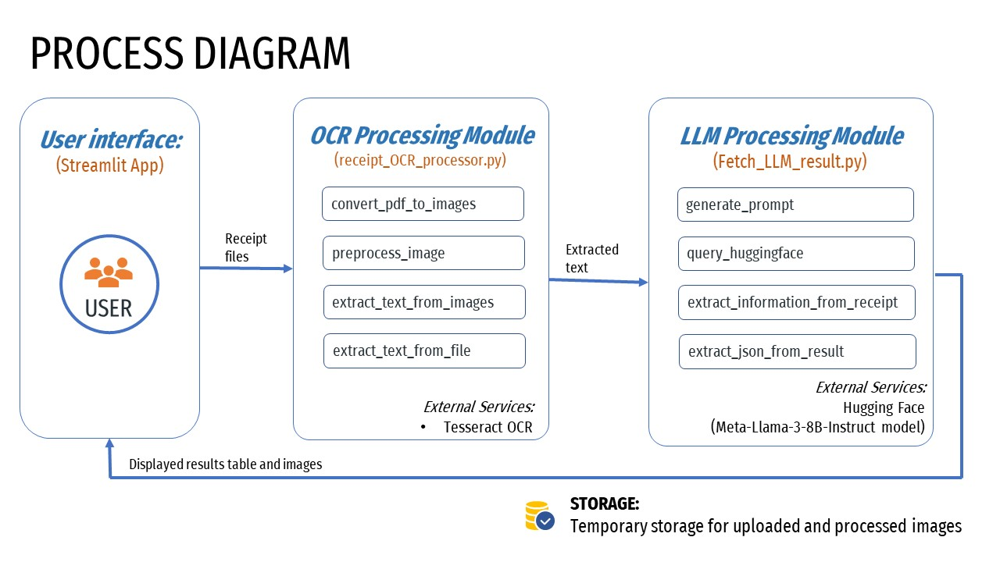

# Receipt Information Extraction

This project is designed to extract information from receipt images or PDFs. It processes the receipts using OCR and extracts structured data such as date, vendor, total amount, tax, and location information. The extracted information is then processed using a language model to provide a structured JSON output.

## App link https://cpsc-receipt.streamlit.app/ 

## Features

1. Convert PDF pages to images.
2. Preprocess images for better OCR results.
3. Extract text from images using Tesseract OCR.
4. Use a language model to extract structured information from the extracted text.
5. Generate a JSON format of the extracted information.

## Flow Chart of Proposed Project



## How to Use

### System Requirements

- Operating System: Windows, macOS, or Linux

### Setup

1. **Clone the repository:**
   ```bash
   git clone https://github.com/hahahassan/Receipt_Text_Extraction.git
   cd <repository-directory>
   ```

2. **Create and activate a virtual environment:**
    ```bash
    python -m venv .venv
    .venv\Scripts\activate  # On Windows
    source .venv/bin/activate  # On macOS/Linux
    ```

3. **Install the required packages:**
    ```bash
    pip install -r requirements.txt
    ```


4. **Install Tesseract OCR**
    Windows: Download and install from this link.

    macOS: Install using Homebrew:  
    ```bash 
    brew install tesseract
    ```

    Linux: Install using your package manager. For example, on Ubuntu
    ```bash
    sudo apt-get install tesseract-ocr
    ```

### Running the Script
To run the script and extract information from a receipt image or PDF, use the following command:

1. **Running:**
    ```bash
    python Fetch_LLM_result.py "uploaded-receipts\IMG_1305_Rr3tdow.jpg"
    ```

2. **Expected output:**
   ```bash
   {
    "Date": "2022-07-14",
    "Vendor": "Punjab Restaurant",
    "Without tax total amount": "23.00",
    "Tax": "2.20",
    "Total amount": "25.20",
    "Country": "Canada",
    "Province": "British Columbia",
    "Comment": "I inferred the country as Canada and the province as British Columbia based on the vendor location 'Surrey BC' which is a city in the province of British Columbia, Canada."
    }
    ```
